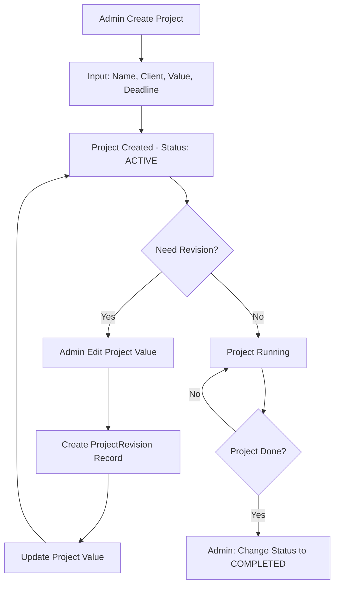
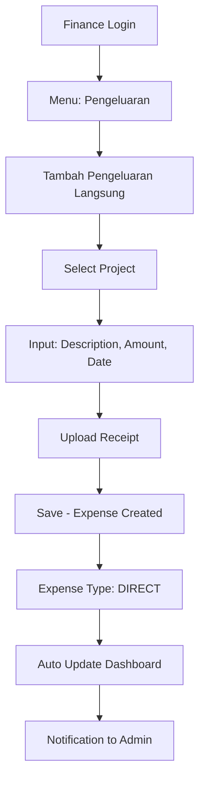
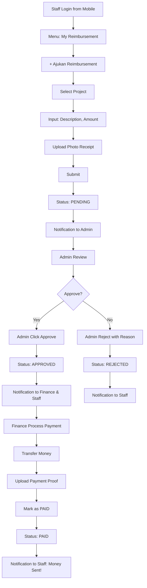

# 🏢 NETKRIDA - Finance Management System
## Dokumentasi Lengkap & Database Schema

---

## 📋 Table of Contents

1. [Overview Sistem](#overview-sistem)
2. [Role & Permission (RBAC)](#role--permission-rbac)
3. [Database Schema](#database-schema)
4. [User Flow](#user-flow)
5. [Feature Specifications](#feature-specifications)
6. [Implementation Guide](#implementation-guide)

---

## Overview Sistem

### Tujuan
Sistem manajemen keuangan sederhana untuk NETKRIDA yang fokus pada:
- ✅ Manajemen Project (nilai, deadline, tracking)
- ✅ Pencatatan Pengeluaran per Project
- ✅ Workflow Reimbursement (Submit → Approve → Pay)
- ✅ Dashboard Monitoring Simple

### Tech Stack
- **Database**: PostgreSQL
- **ORM**: Prisma
- **Authentication**: Better Auth
- **RBAC**: Role-Based Access Control (3 roles)

---

## Role & Permission (RBAC)

### 1️⃣ ADMIN (Owner/Director)

**Deskripsi**: Owner atau Director yang memiliki full access

**Responsibilities**:
- ✅ Create & Edit Projects
- ✅ View semua data (projects, expenses, reimbursements)
- ✅ **Approve Reimbursements** (final approval)
- ✅ Dashboard monitoring
- ✅ Export reports

**Permissions**:
```typescript
{
  projects: {
    create: true,
    read: "all",
    update: true,
    delete: true
  },
  expenses: {
    create: true,
    read: "all",
    update: true,
    delete: true
  },
  reimbursements: {
    create: true,
    read: "all",
    update: false,
    approve: true,      //  Key permission
    processPayment: true
  },
  dashboard: {
    viewAll: true
  },
  reports: {
    generate: true,
    export: true
  }
}
```

---

### 2️⃣ FINANCE (Finance Staff)

**Deskripsi**: Staff keuangan yang handle transaksi & payment

**Responsibilities**:
- ✅ Input Pengeluaran Langsung
- ✅ View semua reimbursements
- ✅ **Process Payment** untuk reimbursement yang sudah approved
- ✅ Upload bukti transfer
- ❌ TIDAK bisa approve reimbursement

**Permissions**:
```typescript
{
  projects: {
    create: false,
    read: "all",
    update: false,
    delete: false
  },
  expenses: {
    create: true,        // Hanya tipe "direct"
    read: "all",
    update: false,
    delete: false
  },
  reimbursements: {
    create: true,
    read: "all",
    update: false,
    approve: false,      // ❌ Tidak bisa approve
    processPayment: true //  Bisa process payment
  },
  dashboard: {
    viewAll: true
  },
  reports: {
    generate: true,
    export: true
  }
}
```

---

### 3️⃣ STAFF (Karyawan)

**Deskripsi**: Karyawan yang submit reimbursement

**Responsibilities**:
- ✅ Submit Reimbursement
- ✅ Upload bukti (foto struk)
- ✅ Track status reimbursement sendiri
- ❌ TIDAK bisa lihat data project
- ❌ TIDAK bisa lihat reimbursement orang lain

**Permissions**:
```typescript
{
  projects: {
    create: false,
    read: "none",
    update: false,
    delete: false
  },
  expenses: {
    create: false,
    read: "none",
    update: false,
    delete: false
  },
  reimbursements: {
    create: true,        //  Hanya create
    read: "own",         //  Hanya milik sendiri
    update: false,
    approve: false,
    processPayment: false
  },
  dashboard: {
    viewAll: false,
    viewOwn: true        // Dashboard pribadi
  },
  reports: {
    generate: false,
    export: false
  }
}
```

---

## Database Schema

### Complete Prisma Schema

```prisma
// ============================================
// NETKRIDA Finance System - Prisma Schema
// ============================================

generator client {
  provider = "prisma-client-js"
  output   = "../generated/prisma"
}

datasource db {
  provider = "postgresql"
  url      = env("DATABASE_URL")
}

// ============================================
// BETTER AUTH MODELS (Existing)
// ============================================

model User {
  id            String    @id
  name          String
  email         String    @unique
  emailVerified Boolean   @default(false)
  image         String?
  role          UserRole  @default(STAFF)     //  Tambahan: Role field
  bankName      String?                       //  Tambahan: Untuk reimbursement
  bankAccountNo String?                       //  Tambahan: Untuk reimbursement
  isActive      Boolean   @default(true)      //  Tambahan: Status aktif
  createdAt     DateTime  @default(now())
  updatedAt     DateTime  @updatedAt

  // Relations
  sessions           Session[]
  accounts           Account[]
  posts              Post[]
  
  //  New Relations - Finance System
  createdProjects    Project[]        @relation("CreatedProjects")
  createdExpenses    Expense[]        @relation("CreatedExpenses")
  submittedReimburse Reimbursement[]  @relation("SubmittedReimbursements")
  approvedReimburse  Reimbursement[]  @relation("ApprovedReimbursements")
  paidReimburse      Reimbursement[]  @relation("PaidReimbursements")
  projectRevisions   ProjectRevision[]

  @@map("user")
}

//  New Enum - User Roles
enum UserRole {
  ADMIN    // Owner/Director
  FINANCE  // Finance Staff
  STAFF    // Regular Employee
}

model Session {
  id        String   @id
  expiresAt DateTime
  token     String   @unique
  createdAt DateTime @default(now())
  updatedAt DateTime @updatedAt
  ipAddress String?
  userAgent String?
  userId    String
  user      User     @relation(fields: [userId], references: [id], onDelete: Cascade)

  @@map("session")
}

model Account {
  id                    String    @id
  accountId             String
  providerId            String
  userId                String
  user                  User      @relation(fields: [userId], references: [id], onDelete: Cascade)
  accessToken           String?
  refreshToken          String?
  idToken               String?
  accessTokenExpiresAt  DateTime?
  refreshTokenExpiresAt DateTime?
  scope                 String?
  password              String?
  createdAt             DateTime  @default(now())
  updatedAt             DateTime  @updatedAt

  @@map("account")
}

model Verification {
  id         String   @id
  identifier String
  value      String
  expiresAt  DateTime
  createdAt  DateTime @default(now())
  updatedAt  DateTime @updatedAt

  @@map("verification")
}

model Post {
  id        String   @id @default(cuid())
  name      String
  createdAt DateTime @default(now())
  updatedAt DateTime @updatedAt

  createdBy   User   @relation(fields: [createdById], references: [id])
  createdById String

  @@index([name])
}

// ============================================
// FINANCE SYSTEM MODELS (New)
// ============================================

//  1. PROJECTS
model Project {
  id           String        @id @default(cuid())
  projectName  String
  clientName   String
  projectValue Decimal       @db.Decimal(15, 2)  // Nilai project dalam Rupiah
  deadline     DateTime
  status       ProjectStatus @default(ACTIVE)
  description  String?       @db.Text
  
  createdAt    DateTime      @default(now())
  updatedAt    DateTime      @updatedAt
  createdBy    User          @relation("CreatedProjects", fields: [createdById], references: [id])
  createdById  String

  // Relations
  expenses         Expense[]
  projectRevisions ProjectRevision[]

  @@index([status])
  @@index([deadline])
  @@map("project")
}

enum ProjectStatus {
  ACTIVE      // Project sedang berjalan
  COMPLETED   // Project selesai
  CANCELLED   // Project dibatalkan
  ON_HOLD     // Project ditunda
}

//  2. PROJECT REVISIONS (Track perubahan nilai project)
model ProjectRevision {
  id          String   @id @default(cuid())
  projectId   String
  project     Project  @relation(fields: [projectId], references: [id], onDelete: Cascade)
  
  oldValue    Decimal  @db.Decimal(15, 2)
  newValue    Decimal  @db.Decimal(15, 2)
  reason      String   @db.Text  // Alasan perubahan (revisi fitur, dll)
  
  changedAt   DateTime @default(now())
  changedBy   User     @relation(fields: [changedById], references: [id])
  changedById String

  @@index([projectId])
  @@map("project_revision")
}

//  3. EXPENSES (Pengeluaran - Langsung atau Reimbursement)
model Expense {
  id           String      @id @default(cuid())
  projectId    String
  project      Project     @relation(fields: [projectId], references: [id], onDelete: Cascade)
  
  expenseType  ExpenseType          // Langsung atau Reimbursement
  description  String      @db.Text
  amount       Decimal     @db.Decimal(15, 2)
  expenseDate  DateTime
  receiptUrl   String?                // URL file bukti (S3, Cloudinary, etc)
  
  createdAt    DateTime    @default(now())
  updatedAt    DateTime    @updatedAt
  createdBy    User        @relation("CreatedExpenses", fields: [createdById], references: [id])
  createdById  String

  // Relations
  reimbursement Reimbursement?

  @@index([projectId])
  @@index([expenseType])
  @@index([expenseDate])
  @@map("expense")
}

enum ExpenseType {
  DIRECT         // Pengeluaran langsung dari kas perusahaan
  REIMBURSEMENT  // Karyawan keluar uang sendiri, perlu reimbursement
}

//  4. REIMBURSEMENTS (Workflow reimbursement)
model Reimbursement {
  id          String             @id @default(cuid())
  expenseId   String             @unique
  expense     Expense            @relation(fields: [expenseId], references: [id], onDelete: Cascade)
  
  status      ReimbursementStatus @default(PENDING)
  
  // Submitted by
  submittedAt DateTime           @default(now())
  submittedBy User               @relation("SubmittedReimbursements", fields: [submittedById], references: [id])
  submittedById String
  
  // Approved by (Admin only)
  approvedAt  DateTime?
  approvedBy  User?              @relation("ApprovedReimbursements", fields: [approvedById], references: [id])
  approvedById String?
  
  // Paid by (Finance)
  paidAt         DateTime?
  paidBy         User?           @relation("PaidReimbursements", fields: [paidById], references: [id])
  paidById       String?
  paymentProofUrl String?        // Bukti transfer
  
  // Rejection
  rejectionReason String?        @db.Text
  
  createdAt   DateTime           @default(now())
  updatedAt   DateTime           @updatedAt

  @@index([status])
  @@index([submittedById])
  @@map("reimbursement")
}

enum ReimbursementStatus {
  PENDING   // Menunggu approval dari Admin
  APPROVED  // Sudah diapprove, menunggu payment
  PAID      // Sudah dibayar
  REJECTED  // Ditolak
}
```

---

## Schema Explanation

### 1. User Model Enhancement

**Perubahan pada User model**:
```prisma
model User {
  // ... existing fields
  
  role          UserRole  @default(STAFF)     //  Role untuk RBAC
  bankName      String?                       //  Nama bank untuk transfer
  bankAccountNo String?                       //  Nomor rekening
  isActive      Boolean   @default(true)      //  Status user
  
  //  New Relations
  createdProjects    Project[]
  createdExpenses    Expense[]
  submittedReimburse Reimbursement[] @relation("SubmittedReimbursements")
  approvedReimburse  Reimbursement[] @relation("ApprovedReimbursements")
  paidReimburse      Reimbursement[] @relation("PaidReimbursements")
}
```

**Kenapa?**
- `role`: Untuk RBAC (ADMIN/FINANCE/STAFF)
- `bankName` & `bankAccountNo`: Untuk proses payment reimbursement
- `isActive`: Untuk soft delete user (tidak perlu hard delete)
- Relations: Track semua aktivitas user di sistem

---

### 2. Project Model

**Purpose**: Menyimpan data project & nilai kontrak

**Key Fields**:
- `projectValue`: Nilai kontrak (bisa berubah karena revisi)
- `deadline`: Tanggal deadline project
- `status`: ACTIVE, COMPLETED, CANCELLED, ON_HOLD

**Relations**:
- `expenses[]`: Semua pengeluaran untuk project ini
- `projectRevisions[]`: History perubahan nilai project

**Use Case**:
```typescript
// Create project
const project = await prisma.project.create({
  data: {
    projectName: "Website Toko Online",
    clientName: "PT Maju Jaya",
    projectValue: 50000000,
    deadline: new Date("2024-12-31"),
    status: "ACTIVE",
    createdById: userId
  }
})

// Update project value (ada revisi)
const revision = await prisma.projectRevision.create({
  data: {
    projectId: project.id,
    oldValue: 50000000,
    newValue: 65000000,
    reason: "Tambah fitur payment gateway",
    changedById: userId
  }
})

await prisma.project.update({
  where: { id: project.id },
  data: { projectValue: 65000000 }
})
```

---

### 3. Project Revision Model

**Purpose**: Track history perubahan nilai project (audit trail)

**Why separate table?**
- Maintain history lengkap
- Compliance & audit
- Bisa lihat alasan setiap perubahan
- Siapa yang ubah & kapan

**Query Example**:
```typescript
// Get revision history
const revisions = await prisma.projectRevision.findMany({
  where: { projectId: "xxx" },
  include: { changedBy: true },
  orderBy: { changedAt: "desc" }
})
```

---

### 4. Expense Model

**Purpose**: Menyimpan semua pengeluaran (langsung & reimbursement)

**Key Fields**:
- `expenseType`: DIRECT atau REIMBURSEMENT
- `amount`: Nominal pengeluaran
- `receiptUrl`: Link ke file bukti (struk, invoice)

**Relationship**:
- `project`: Setiap expense terkait dengan 1 project
- `reimbursement`: Jika expenseType = REIMBURSEMENT, akan ada record di tabel Reimbursement

**Use Case - Direct Expense**:
```typescript
// Finance input pengeluaran langsung
const expense = await prisma.expense.create({
  data: {
    projectId: "xxx",
    expenseType: "DIRECT",
    description: "Bayar hosting server 1 tahun",
    amount: 3000000,
    expenseDate: new Date(),
    receiptUrl: "https://storage.../invoice.pdf",
    createdById: financeUserId
  }
})
```

**Use Case - Reimbursement Expense**:
```typescript
// Staff submit reimbursement
const expense = await prisma.expense.create({
  data: {
    projectId: "xxx",
    expenseType: "REIMBURSEMENT",
    description: "Beli domain & SSL",
    amount: 1500000,
    expenseDate: new Date(),
    receiptUrl: "https://storage.../struk.jpg",
    createdById: staffUserId,
    reimbursement: {
      create: {
        submittedById: staffUserId,
        status: "PENDING"
      }
    }
  },
  include: { reimbursement: true }
})
```

---

### 5. Reimbursement Model

**Purpose**: Handle workflow reimbursement (Submit → Approve → Pay)

**Status Flow**:
```
PENDING → APPROVED → PAID
   ↓
REJECTED
```

**Key Fields**:
- `status`: Current status workflow
- `submittedBy`: Staff yang submit
- `approvedBy`: Admin yang approve
- `paidBy`: Finance yang process payment
- `paymentProofUrl`: Bukti transfer dari Finance

**Workflow Example**:

**STEP 1 - Submit (Staff)**:
```typescript
// Already done saat create expense di atas
```

**STEP 2 - Approve (Admin)**:
```typescript
const reimbursement = await prisma.reimbursement.update({
  where: { id: "xxx" },
  data: {
    status: "APPROVED",
    approvedAt: new Date(),
    approvedById: adminUserId
  }
})
// Send notification ke Finance & Staff
```

**STEP 3 - Process Payment (Finance)**:
```typescript
// Finance transfer uang & upload bukti
const reimbursement = await prisma.reimbursement.update({
  where: { id: "xxx" },
  data: {
    status: "PAID",
    paidAt: new Date(),
    paidById: financeUserId,
    paymentProofUrl: "https://storage.../bukti-transfer.jpg"
  }
})
// Send notification ke Staff: "Uang sudah ditransfer!"
```

**REJECT (Admin)**:
```typescript
const reimbursement = await prisma.reimbursement.update({
  where: { id: "xxx" },
  data: {
    status: "REJECTED",
    rejectionReason: "Bukti tidak lengkap, mohon upload ulang"
  }
})
```

---

## User Flow

### 1. Project Management Flow



---

### 2. Direct Expense Flow



---

### 3. Reimbursement Flow



---

## Feature Specifications

### Dashboard Queries

**Admin Dashboard**:
```typescript
// Get total active project value
const totalProjectValue = await prisma.project.aggregate({
  where: { status: "ACTIVE" },
  _sum: { projectValue: true }
})

// Get total expenses
const totalExpenses = await prisma.expense.aggregate({
  _sum: { amount: true }
})

// Get pending reimbursements
const pendingReimbursements = await prisma.reimbursement.findMany({
  where: { status: "PENDING" },
  include: {
    expense: {
      include: {
        project: true
      }
    },
    submittedBy: true
  }
})

// Dashboard data
const dashboard = {
  totalProjectValue: totalProjectValue._sum.projectValue || 0,
  totalExpenses: totalExpenses._sum.amount || 0,
  pendingReimbursementAmount: pendingReimbursements.reduce(
    (sum, r) => sum + r.expense.amount, 0
  ),
  pendingCount: pendingReimbursements.length
}
```

**Finance Dashboard**:
```typescript
// Get approved but unpaid reimbursements
const needPayment = await prisma.reimbursement.findMany({
  where: { status: "APPROVED" },
  include: {
    expense: {
      include: { project: true }
    },
    submittedBy: {
      select: {
        id: true,
        name: true,
        bankName: true,
        bankAccountNo: true
      }
    }
  }
})

// Get paid today
const paidToday = await prisma.reimbursement.count({
  where: {
    status: "PAID",
    paidAt: {
      gte: new Date(new Date().setHours(0, 0, 0, 0))
    }
  }
})
```

**Staff Dashboard**:
```typescript
const userId = session.user.id

// Get own reimbursements summary
const myReimbursements = await prisma.reimbursement.findMany({
  where: { submittedById: userId },
  include: {
    expense: {
      include: { project: true }
    }
  }
})

const summary = {
  pending: myReimbursements.filter(r => r.status === "PENDING"),
  approved: myReimbursements.filter(r => r.status === "APPROVED"),
  paid: myReimbursements.filter(r => r.status === "PAID"),
  rejected: myReimbursements.filter(r => r.status === "REJECTED")
}
```

---

### Project Detail Query

```typescript
// Get project with all expenses
const projectDetail = await prisma.project.findUnique({
  where: { id: projectId },
  include: {
    expenses: {
      include: {
        createdBy: {
          select: { id: true, name: true }
        },
        reimbursement: {
          select: { status: true }
        }
      },
      orderBy: { expenseDate: "desc" }
    },
    projectRevisions: {
      include: {
        changedBy: {
          select: { name: true }
        }
      },
      orderBy: { changedAt: "desc" }
    },
    createdBy: {
      select: { id: true, name: true }
    }
  }
})

// Calculate total expenses
const totalExpenses = projectDetail.expenses.reduce(
  (sum, expense) => sum + expense.amount, 0
)

// Return with calculation
const result = {
  ...projectDetail,
  totalExpenses,
  remainingBudget: projectDetail.projectValue - totalExpenses,
  percentageUsed: (totalExpenses / projectDetail.projectValue) * 100
}
```

---

## Implementation Guide

### Step 1: Migration

```bash
# Backup existing database first!
# Then run migration

npx prisma migrate dev --name add_finance_system
```

### Step 2: Seed Initial Data

```typescript
// prisma/seed.ts

import { PrismaClient, UserRole } from "@prisma/client"

const prisma = new PrismaClient()

async function main() {
  // Create Admin user
  const admin = await prisma.user.upsert({
    where: { email: "admin@netkrida.co.id" },
    update: {},
    create: {
      id: "admin-001",
      name: "Pak Bos",
      email: "admin@netkrida.co.id",
      role: "ADMIN",
      emailVerified: true,
      isActive: true
    }
  })

  // Create Finance user
  const finance = await prisma.user.upsert({
    where: { email: "finance@netkrida.co.id" },
    update: {},
    create: {
      id: "finance-001",
      name: "Siti Finance",
      email: "finance@netkrida.co.id",
      role: "FINANCE",
      emailVerified: true,
      isActive: true
    }
  })

  // Create Staff user
  const staff = await prisma.user.upsert({
    where: { email: "andi@netkrida.co.id" },
    update: {},
    create: {
      id: "staff-001",
      name: "Andi Developer",
      email: "andi@netkrida.co.id",
      role: "STAFF",
      emailVerified: true,
      isActive: true,
      bankName: "BCA",
      bankAccountNo: "1234567890"
    }
  })

  console.log({ admin, finance, staff })
}

main()
  .catch((e) => {
    console.error(e)
    process.exit(1)
  })
  .finally(async () => {
    await prisma.$disconnect()
  })
```

Run seed:
```bash
npx prisma db seed
```

---

### Step 3: RBAC Middleware

```typescript
// lib/rbac.ts

import { UserRole } from "@prisma/client"
import { Session } from "better-auth"

type Permission = {
  resource: string
  action: "create" | "read" | "update" | "delete" | "approve" | "pay"
  scope?: "all" | "own" | "none"
}

const rolePermissions: Record<UserRole, Permission[]> = {
  ADMIN: [
    { resource: "project", action: "create" },
    { resource: "project", action: "read", scope: "all" },
    { resource: "project", action: "update" },
    { resource: "project", action: "delete" },
    { resource: "expense", action: "create" },
    { resource: "expense", action: "read", scope: "all" },
    { resource: "expense", action: "update" },
    { resource: "expense", action: "delete" },
    { resource: "reimbursement", action: "create" },
    { resource: "reimbursement", action: "read", scope: "all" },
    { resource: "reimbursement", action: "approve" },
    { resource: "reimbursement", action: "pay" },
  ],
  
  FINANCE: [
    { resource: "project", action: "read", scope: "all" },
    { resource: "expense", action: "create" }, // Only DIRECT type
    { resource: "expense", action: "read", scope: "all" },
    { resource: "reimbursement", action: "create" },
    { resource: "reimbursement", action: "read", scope: "all" },
    { resource: "reimbursement", action: "pay" },
  ],
  
  STAFF: [
    { resource: "reimbursement", action: "create" },
    { resource: "reimbursement", action: "read", scope: "own" },
  ]
}

export function hasPermission(
  userRole: UserRole,
  resource: string,
  action: Permission["action"]
): boolean {
  const permissions = rolePermissions[userRole]
  return permissions.some(
    p => p.resource === resource && p.action === action
  )
}

export function canAccessResource(
  userRole: UserRole,
  resource: string,
  action: Permission["action"],
  resourceOwnerId?: string,
  currentUserId?: string
): boolean {
  const permissions = rolePermissions[userRole]
  const permission = permissions.find(
    p => p.resource === resource && p.action === action
  )
  
  if (!permission) return false
  
  // Check scope
  if (permission.scope === "all") return true
  if (permission.scope === "own") {
    return resourceOwnerId === currentUserId
  }
  if (permission.scope === "none") return false
  
  return true
}

// Middleware untuk protect routes
export async function requireRole(
  session: Session | null,
  allowedRoles: UserRole[]
) {
  if (!session?.user) {
    throw new Error("Unauthorized")
  }
  
  // Get user role from database
  const user = await prisma.user.findUnique({
    where: { id: session.user.id },
    select: { role: true, isActive: true }
  })
  
  if (!user?.isActive) {
    throw new Error("User is not active")
  }
  
  if (!allowedRoles.includes(user.role)) {
    throw new Error("Forbidden: Insufficient permissions")
  }
  
  return user
}
```

---

### Step 4: API Routes Example

```typescript
// app/api/projects/create/route.ts

import { auth } from "@/lib/auth"
import { requireRole } from "@/lib/rbac"
import { prisma } from "@/lib/prisma"

export async function POST(req: Request) {
  const session = await auth.api.getSession({
    headers: req.headers
  })
  
  // Only ADMIN can create project
  const user = await requireRole(session, ["ADMIN"])
  
  const body = await req.json()
  
  const project = await prisma.project.create({
    data: {
      projectName: body.projectName,
      clientName: body.clientName,
      projectValue: body.projectValue,
      deadline: new Date(body.deadline),
      status: "ACTIVE",
      createdById: user.id
    }
  })
  
  return Response.json({ project })
}
```

```typescript
// app/api/reimbursements/approve/route.ts

import { auth } from "@/lib/auth"
import { requireRole } from "@/lib/rbac"
import { prisma } from "@/lib/prisma"

export async function POST(req: Request) {
  const session = await auth.api.getSession({
    headers: req.headers
  })
  
  // Only ADMIN can approve
  const user = await requireRole(session, ["ADMIN"])
  
  const body = await req.json()
  const { reimbursementId } = body
  
  const reimbursement = await prisma.reimbursement.update({
    where: { id: reimbursementId },
    data: {
      status: "APPROVED",
      approvedAt: new Date(),
      approvedById: user.id
    },
    include: {
      expense: true,
      submittedBy: {
        select: { name: true, email: true }
      }
    }
  })
  
  // TODO: Send notification to Finance & Staff
  
  return Response.json({ reimbursement })
}
```

```typescript
// app/api/reimbursements/pay/route.ts

import { auth } from "@/lib/auth"
import { requireRole } from "@/lib/rbac"
import { prisma } from "@/lib/prisma"

export async function POST(req: Request) {
  const session = await auth.api.getSession({
    headers: req.headers
  })
  
  // ADMIN or FINANCE can process payment
  const user = await requireRole(session, ["ADMIN", "FINANCE"])
  
  const body = await req.json()
  const { reimbursementId, paymentProofUrl } = body
  
  const reimbursement = await prisma.reimbursement.update({
    where: {
      id: reimbursementId,
      status: "APPROVED" // Must be approved first
    },
    data: {
      status: "PAID",
      paidAt: new Date(),
      paidById: user.id,
      paymentProofUrl
    },
    include: {
      expense: true,
      submittedBy: {
        select: { 
          name: true, 
          email: true,
          bankName: true,
          bankAccountNo: true
        }
      }
    }
  })
  
  // TODO: Send notification to Staff
  
  return Response.json({ reimbursement })
}
```

```typescript
// app/api/reimbursements/my/route.ts

import { auth } from "@/lib/auth"
import { prisma } from "@/lib/prisma"

export async function GET(req: Request) {
  const session = await auth.api.getSession({
    headers: req.headers
  })
  
  if (!session?.user) {
    return Response.json({ error: "Unauthorized" }, { status: 401 })
  }
  
  // Staff can only see their own reimbursements
  const reimbursements = await prisma.reimbursement.findMany({
    where: { submittedById: session.user.id },
    include: {
      expense: {
        include: { project: true }
      }
    },
    orderBy: { createdAt: "desc" }
  })
  
  return Response.json({ reimbursements })
}
```

---

## Summary

### Database Tables (5 New + Enhanced User)
1. ✅ **User** (enhanced with role, bank info)
2. ✅ **Project** (project info & nilai)
3. ✅ **ProjectRevision** (track perubahan nilai)
4. ✅ **Expense** (semua pengeluaran)
5. ✅ **Reimbursement** (workflow reimbursement)

### RBAC Implementation
- ✅ 3 Roles: ADMIN, FINANCE, STAFF
- ✅ Permission mapping per role
- ✅ Middleware untuk protect routes
- ✅ Scope-based access (all/own/none)

### Key Features
- ✅ Project management dengan revision history
- ✅ Pengeluaran langsung (Finance input)
- ✅ Reimbursement workflow (3 steps)
- ✅ Dashboard per role
- ✅ Notification system ready
- ✅ Audit trail lengkap

---

## Next Steps

1. ✅ Review schema ini
2. ✅ Run migration
3. ✅ Seed initial users
4. ✅ Implement RBAC middleware
5. ✅ Build API routes
6. ✅ Build frontend components
7. ✅ Setup file upload (S3/Cloudinary)
8. ✅ Implement notification system
9. ✅ Testing & deployment

---

**Sistem siap diimplementasikan!** 🚀

Apakah ada yang perlu disesuaikan dari schema atau penjelasan di atas?
